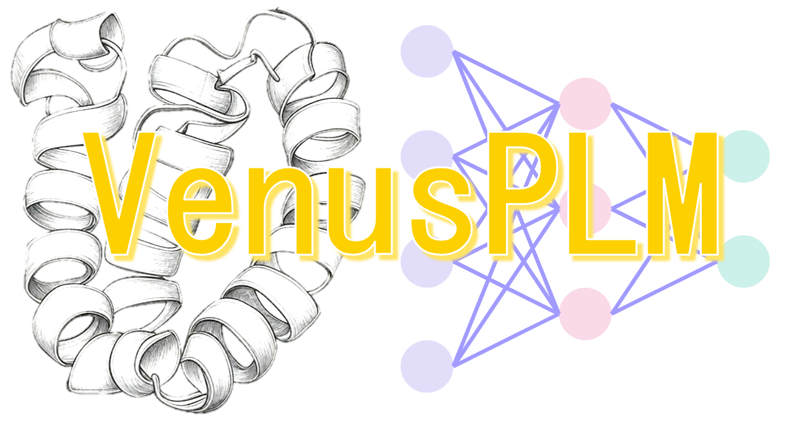
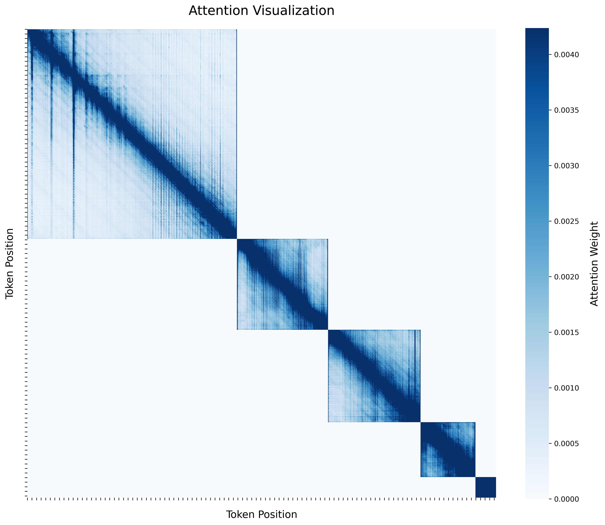

# VenusPLM


## Description
VenusPLM is a project focused on developing Versatile Embedding Network for Understanding Sequences

## Installation
You can install VenusPLM and its dependencies using pip:

To install VenusPLM, follow these steps:
1. Clone the repository: `git clone https://github.com/ai4protein/VenusPLM.git`
2. Navigate to the project directory: `cd VenusPLM`
3. Install the required dependencies: 
- Install PyTorch
```bash
pip3 install torch torchvision torchaudio
```
- Install Transformers
```bash
pip3 install transformers
```
- Install flash-attn (Optional)
```bash
pip install flash-attn --no-build-isolation
```
- Install other dependencies
```bash
pip install -r requirements.txt
```

## Usage
To use VenusPLM, follow these steps:
1. Prepare your protein data.
2. Run the model: `python run_model.py --input your_protein_data.fasta --output results.txt`

## Sequence Packing Attention Visualization

